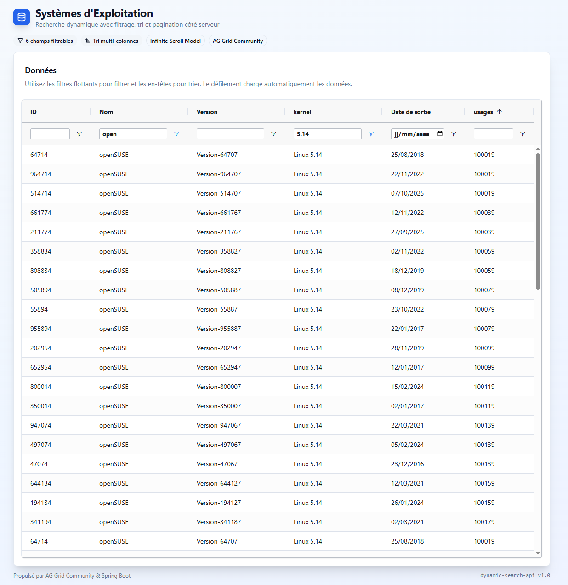

# Dynamic Search Library

[](https://openjdk.java.net/)
[](https://spring.io/projects/spring-boot)
[](LICENSE)

Bibliothèque pour construire des **recherches dynamiques** avancées dans les applications **Spring Boot**.

Support **JPA** (SQL), **MongoDB** (NoSQL) et **Elasticsearch** (Search Engine)

## 🎯 Fonctionnalités

- ✅ **Filtrage dynamique** - 13 opérateurs (EQUALS, CONTAINS, BETWEEN, etc.)
- ✅ **Tri dynamique** - ASC/DESC sur n'importe quel champ
- ✅ **Pagination** - Page et taille configurables
- ✅ **Détection automatique des types** - Plus besoin de spécifier le fieldType
- ✅ **Support multi-formats de dates** - ISO, formats européens, américains
- ✅ **Architecture hexagonale** - Découplage domaine/infrastructure
- ✅ **Support JPA, MongoDB et Elasticsearch** - Même API pour tous
- ✅ **Spring Boot Auto-configuration** - Configuration automatique
- ✅ **Type-safe** - Utilisation d'enums pour les opérateurs

## 📦 Structure des Modules

```
dynamic-search/
├── dynamic-search-domain                    # Couche domaine (logique métier)
│   ├── model/                               # Modèles du domaine
│   ├── port/in/                             # Ports entrants (use cases)
│   ├── port/out/                            # Ports sortants (repositories)
│   └── service/                             # Services du domaine
├── dynamic-search-spring-boot-starter       # Starter Spring Boot commun
│   ├── gateway/                             # SearchGateway (façade)
│   ├── mapper/                              # Mappers REST ↔ Domaine
│   ├── request/                             # DTOs de requête
│   └── response/                            # DTOs de réponse
├── dynamic-search-spring-boot-jpa-starter   # Implémentation JPA
│   ├── adapter/                             # Adaptateurs JPA
│   ├── specification/                       # Specifications JPA
│   └── factory/                             # Factory pour JPA
├── dynamic-search-spring-boot-mongo-starter # Implémentation MongoDB
│   ├── adapter/                             # Adaptateurs MongoDB
│   ├── criteria/                            # Criteria MongoDB
│   └── factory/                             # Factory pour MongoDB
├── dynamic-search-spring-boot-elasticsearch-starter # Implémentation Elasticsearch
│   ├── adapter/                             # Adaptateurs Elasticsearch
│   ├── criteria/                            # Criteria Elasticsearch
│   └── factory/                             # Factory pour Elasticsearch
└── dynamic-search-spring-boot-jpa-example   # Exemple JPA + React Frontend
    ├── src/main/java                         # Backend Spring Boot
    └── src/main/resources/webapp             # Frontend React + AG Grid
```

## 🖥️ Frontend React avec AG Grid



L'exemple JPA inclut une **interface web moderne** avec :
- ✅ **AG Grid Infinite Row Model** - Pagination/tri/filtrage côté serveur
- ✅ **Génération dynamique des colonnes** - Basée sur les métadonnées de l'API
- ✅ **Filtres natifs AG Grid** - Mappés automatiquement vers l'API
  - Texte : contains, equals, startsWith, endsWith, blank, notBlank
  - Nombre : equals, lessThan, greaterThan, between
  - Date : equals, lessThan, greaterThan, between (formatage automatique YYYY-MM-DD)
  - Booléen : equals via selection
- ✅ **Formatage automatique des dates** - AG Grid → API (suppression timestamp)
- ✅ **Single JAR deployment** - Frontend compilé dans le JAR Spring Boot

👉 Voir [FRONTEND.md](dynamic-search-spring-boot-jpa-example/FRONTEND.md) pour la documentation complète du frontend.

### Démarrage Rapide du Frontend

```bash
# Méthode 1 : Tout-en-un (Maven build + frontend)
cd dynamic-search-spring-boot-jpa-example
mvn clean package
java -jar target/dynamic-search-spring-boot-jpa-example-0.0.1-SNAPSHOT.jar
# Accès : http://localhost:8080

# Méthode 2 : Développement avec hot reload
# Terminal 1 - Backend
mvn spring-boot:run

# Terminal 2 - Frontend
cd src/main/resources/webapp
npm run dev
# Accès : http://localhost:5173
```

## 🚀 Quick Start

### 1. Ajouter la dépendance

**Pour JPA (SQL) :**
```xml
<dependency>
    <groupId>io.github.cnadjim</groupId>
    <artifactId>dynamic-search-spring-boot-jpa-starter</artifactId>
    <version>0.0.1-SNAPSHOT</version>
</dependency>
```

**Pour MongoDB :**
```xml
<dependency>
    <groupId>io.github.cnadjim</groupId>
    <artifactId>dynamic-search-spring-boot-mongo-starter</artifactId>
    <version>0.0.1-SNAPSHOT</version>
</dependency>
```

**Pour Elasticsearch :**
```xml
<dependency>
    <groupId>io.github.cnadjim</groupId>
    <artifactId>dynamic-search-spring-boot-elasticsearch-starter</artifactId>
    <version>0.0.1-SNAPSHOT</version>
</dependency>
```

### 2. Annoter votre entité

**JPA :**
```java
@Entity
@Table(name = "operating_systems")
@EnableSearchable  // Active la recherche dynamique
public class OperatingSystem {
    @Id
    @GeneratedValue(strategy = GenerationType.IDENTITY)
    private Long id;

    private String name;
    private String version;
    private LocalDateTime releaseDate;
    private Integer marketShare;
    private Boolean isOpenSource;

    // Getters/Setters...
}
```

**MongoDB :**
```java
@Document(collection = "operating_systems")
@EnableSearchable  // Active la recherche dynamique
public class OperatingSystem {
    @Id
    private String id;

    private String name;
    private String version;
    private LocalDateTime releaseDate;
    private Integer marketShare;
    private Boolean isOpenSource;

    // Getters/Setters...
}
```

**Elasticsearch :**
```java
@Document(indexName = "operating_systems")
@EnableSearchable  // Active la recherche dynamique
public class OperatingSystem {
    @Id
    private String id;

    private String name;
    private String version;
    private LocalDateTime releaseDate;
    private Integer marketShare;
    private Boolean isOpenSource;

    // Getters/Setters...
}
```

### 3. Créer un contrôleur

```java
@RestController
@RequestMapping("/api/operating-systems")
@RequiredArgsConstructor
public class OperatingSystemController {

    private final SearchGateway searchGateway;

    @GetMapping("/filters")
    public List<FilterDescriptorResponse> getAvailableFilters() {
        return searchGateway.getAvailableFilters(OperatingSystem.class);
    }

    @PostMapping("/search")
    public SearchResult<OperatingSystem> search(@RequestBody SearchRequest request) {
        return searchGateway.search(request, OperatingSystem.class);
    }
}
```

### 4. Effectuer une recherche

**Requête HTTP POST** `/api/operating-systems/search` :

```json
{
  "filters": [
    {
      "key": "name",
      "operator": "contains",
      "value": "Windows"
    },
    {
      "key": "releaseDate",
      "operator": "between",
      "value": "2015-01-01",
      "valueTo": "2020-12-31"
    },
    {
      "key": "marketShare",
      "operator": "greaterThan",
      "value": "10"
    },
    {
      "key": "isOpenSource",
      "operator": "equals",
      "value": "false"
    }
  ],
  "sorts": [
    {
      "key": "releaseDate",
      "direction": "desc"
    }
  ],
  "pageRequest": {
    "page": 0,
    "size": 10
  }
}
```

**Réponse :**

```json
{
  "content": [
    {
      "id": 1,
      "name": "Windows 10",
      "version": "21H2",
      "releaseDate": "2015-07-29T00:00:00",
      "marketShare": 69,
      "isOpenSource": false
    }
  ],
  "totalElements": 1,
  "totalPages": 1,
  "currentPage": 0,
  "pageSize": 10
}
```

## 🔍 Opérateurs Disponibles

| Opérateur      | Description                           | Types supportés     | Exemple                              |
|----------------|---------------------------------------|---------------------|--------------------------------------|
| `equals`       | Égalité stricte                       | Tous                | `"value": "Windows"`                 |
| `notEquals`    | Différent de                          | Tous                | `"value": "Linux"`                   |
| `contains`     | Contient (case insensitive)           | STRING              | `"value": "Win"`                     |
| `notContains`  | Ne contient pas (case insensitive)    | STRING              | `"value": "Mac"`                     |
| `startsWith`   | Commence par (case insensitive)       | STRING              | `"value": "Win"`                     |
| `endsWith`     | Se termine par (case insensitive)     | STRING              | `"value": "10"`                      |
| `in`           | Valeur dans une liste                 | Tous                | `"values": ["Windows", "Linux"]`     |
| `notIn`        | Valeur pas dans une liste             | Tous                | `"values": ["macOS", "iOS"]`         |
| `lessThan`     | Inférieur à                           | NUMBER, DATE        | `"value": "100"`                     |
| `greaterThan`  | Supérieur à                           | NUMBER, DATE        | `"value": "50"`                      |
| `between`      | Entre deux valeurs (inclusif)         | NUMBER, DATE        | `"value": "10", "valueTo": "100"`    |
| `blank`        | Null ou vide                          | STRING              | (pas de valeur)                      |
| `notBlank`     | Non null et non vide                  | STRING              | (pas de valeur)                      |

## 📅 Gestion Intelligente des Dates

### Formats supportés

La bibliothèque supporte automatiquement plusieurs formats de dates :

- **ISO 8601** : `2024-12-03T10:00:00` ou `2024-12-03`
- **Format SQL** : `2024-12-03 10:00:00`
- **Format européen** : `03-12-2024 10:00:00` ou `03/12/2024 10:00:00`

### Recherche par jour entier

Lorsque vous utilisez l'opérateur `equals` avec une date **sans heure** (format `yyyy-MM-dd`), la bibliothèque convertit automatiquement la recherche en `BETWEEN` pour matcher toute la journée :

**Requête :**
```json
{
  "filters": [
    {
      "key": "releaseDate",
      "operator": "equals",
      "value": "2019-11-05"
    }
  ]
}
```

**Équivalent automatique :**
```json
{
  "filters": [
    {
      "key": "releaseDate",
      "operator": "between",
      "value": "2019-11-05T00:00:00",
      "valueTo": "2019-11-05T23:59:59.999999999"
    }
  ]
}
```

## 🎨 Détection Automatique des Types

Vous n'avez **plus besoin** de spécifier le `fieldType` dans vos requêtes ! La bibliothèque le déduit automatiquement depuis les métadonnées de l'entité.

**Avant :**
```json
{
  "key": "releaseDate",
  "operator": "equals",
  "fieldType": "date",
  "value": "2019-11-05"
}
```

**Maintenant :**
```json
{
  "key": "releaseDate",
  "operator": "equals",
  "value": "2019-11-05"
}
```

## 🏗️ Architecture Hexagonale

La bibliothèque suit les principes de l'**architecture hexagonale** (Ports & Adapters) :

```
┌──────────────────────────────────────────────────────────────┐
│                         APPLICATION                          │
│                    (Controllers REST)                        │
└─────────────────────────┬────────────────────────────────────┘
                          │
                          ▼
┌──────────────────────────────────────────────────────────────┐
│                      SEARCH GATEWAY                          │
│              (Façade pour simplifier l'API)                  │
└─────────────────────────┬────────────────────────────────────┘
                          │
                          ▼
┌──────────────────────────────────────────────────────────────┐
│                    COUCHE DOMAINE                            │
│  ┌────────────────┐  ┌──────────────┐  ┌─────────────────┐  │
│  │  Use Cases     │  │   Models     │  │    Services     │  │
│  │  (Ports In)    │  │  (Entities)  │  │   (Business)    │  │
│  └────────────────┘  └──────────────┘  └─────────────────┘  │
│           │                                       │           │
│           ▼                                       ▼           │
│  ┌────────────────────────────────────────────────────────┐  │
│  │          Repositories (Ports Out)                      │  │
│  └────────────────────────────────────────────────────────┘  │
└─────────────────────────┬────────────────────────────────────┘
                          │
         ┌────────────────┴───────────────┐
         ▼                                ▼
┌─────────────────────┐        ┌──────────────────────┐
│  JPA ADAPTER        │        │  MONGODB ADAPTER     │
│  - Specifications   │        │  - Criteria Builder  │
│  - JPA Repository   │        │  - MongoTemplate     │
└─────────────────────┘        └──────────────────────┘
```

### Avantages

- **Découplage** - Le domaine ne dépend pas de l'infrastructure
- **Testabilité** - Tests unitaires du domaine sans DB
- **Flexibilité** - Changement facile d'implémentation (JPA ↔ MongoDB)
- **Évolutivité** - Ajout facile de nouveaux adaptateurs (Elasticsearch, etc.)

## 📚 Exemples Avancés

### Recherche avec plusieurs filtres ET

```json
{
  "filters": [
    {
      "key": "name",
      "operator": "contains",
      "value": "Windows"
    },
    {
      "key": "isOpenSource",
      "operator": "equals",
      "value": "false"
    },
    {
      "key": "marketShare",
      "operator": "greaterThan",
      "value": "50"
    }
  ]
}
```

### Recherche avec IN

```json
{
  "filters": [
    {
      "key": "version",
      "operator": "in",
      "values": ["10", "11", "Server 2019"]
    }
  ]
}
```

### Recherche avec BETWEEN

```json
{
  "filters": [
    {
      "key": "marketShare",
      "operator": "between",
      "value": "10",
      "valueTo": "90"
    }
  ]
}
```

### Tri multiple

```json
{
  "sorts": [
    {
      "key": "marketShare",
      "direction": "desc"
    },
    {
      "key": "name",
      "direction": "asc"
    }
  ]
}
```

### Pagination

```json
{
  "pageRequest": {
    "page": 2,
    "size": 20
  }
}
```

## 🛠️ Configuration

### Application Properties

**Pour JPA :**
```properties
# DataSource
spring.datasource.url=jdbc:h2:mem:testdb
spring.datasource.username=sa
spring.datasource.password=

# JPA/Hibernate
spring.jpa.hibernate.ddl-auto=create-drop
spring.jpa.show-sql=true
```

**Pour MongoDB :**
```properties
# MongoDB
spring.data.mongodb.uri=mongodb://localhost:27017/test
spring.data.mongodb.database=test
```

### Initialisation de données (optionnel)

Vous pouvez activer l'initialisation automatique de données de test :

```properties
# Générer 1 million d'enregistrements au démarrage (pour tests de performance)
app.data.init.enabled=true
```

## 🧪 Tests

### Lancer tous les tests

```bash
cd dynamic-search
mvn clean test
```

### Lancer les tests d'un module spécifique

```bash
# Tests du domaine
mvn clean test -pl dynamic-search-domain

# Tests JPA
mvn clean test -pl dynamic-search-spring-boot-jpa-starter

# Tests MongoDB
mvn clean test -pl dynamic-search-spring-boot-mongo-starter
```

## 📊 Performances

La bibliothèque a été testée avec **1 million d'enregistrements** :

- **Recherche simple** : ~50-100ms
- **Recherche avec filtres multiples** : ~100-200ms
- **Recherche avec tri** : ~150-250ms
- **Recherche avec pagination** : ~50-100ms

*Les performances dépendent de la configuration de votre base de données et des index définis.*

## 🤝 Contribution

Les contributions sont les bienvenues ! N'hésitez pas à :

1. Fork le projet
2. Créer une branche (`git checkout -b feature/AmazingFeature`)
3. Commit vos changements (`git commit -m 'Add some AmazingFeature'`)
4. Push vers la branche (`git push origin feature/AmazingFeature`)
5. Ouvrir une Pull Request

## 📝 License

Ce projet est sous licence MIT - voir le fichier [LICENSE](LICENSE) pour plus de détails.

## 📧 Contact

Pour toute question ou suggestion : [cnadjim@github.io](https://github.com/cnadjim)

---

⭐ **N'oubliez pas de mettre une étoile si vous trouvez ce projet utile !** ⭐
